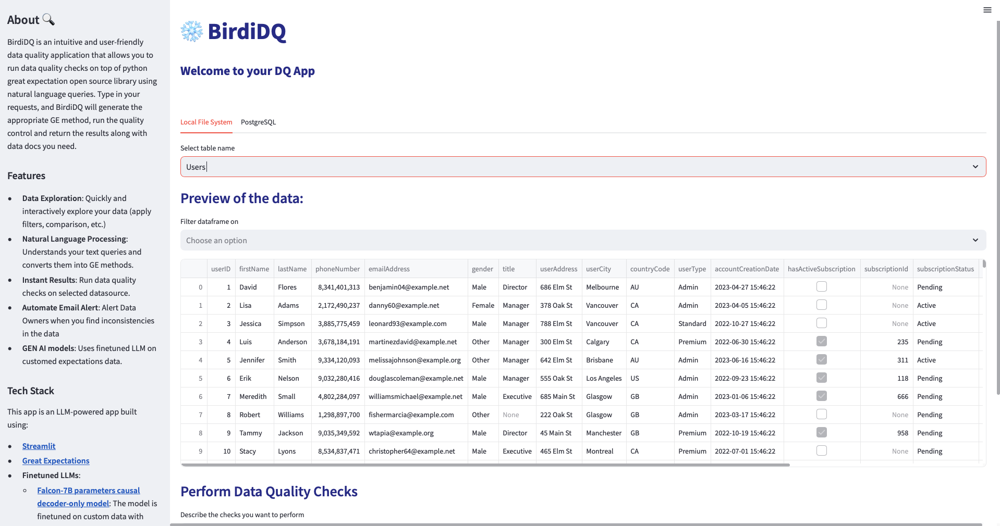

# BirdiDQ - About 🔍

BirdiDQ is an intuitive and user-friendly data quality application that allows you to run data quality checks on top of python great expectation open source library using natural language queries. Type in your requests, and BirdiDQ will generate the appropriate GE method, run the quality control and return the results along with data docs you need. [Demo Video](https://youtu.be/iPLSUL4SjBk)

## Note

BirdiDQ is under development and is an open source project. Contributions are welcomed!

## Features

- **🔍 Data Exploration Made Easy:** Quickly and interactively explore your data using a range of features like filters, comparisons, and more. Uncover hidden insights and make informed decisions with confidence.
- **🎯 Natural Language Processing:**: Speak BirdiDQ's language! No technical expertise required. Simply type in your queries, and BirdiDQ intelligently converts them into powerful Great Expectations methods (using a fine-tuned Large Language Model), saving you time and effort..
- **⚡ Instant Results**: Run comprehensive data quality checks on your selected data sources, and get instant feedback on data inconsistencies. BirdiDQ ensures that your data is reliable and trustworthy.
- **📧Automate Email Alert**: Reach out to the Data Owner directly through the app, sending them an email with the detailed data quality report generated by Great Expectations.
- **GEN AI models**: Uses finetuned LLM on customed expectations data.

## Tech Stack

This app is an LLM-powered app built using:

- **[Streamlit](https://streamlit.io/)**
- **[Great Expectations](https://github.com/Soulter/hugging-chat-api)**
- **Finetuned LLMs**:
  - **[Falcon-7B parameters causal decoder-only model](https://huggingface.co/tiiuae/falcon-7b)**: The model is finetuned on custom data with **Qlora** approach.
  - **[OpenAI GPT-3](https://platform.openai.com/docs/guides/fine-tuning)**: Also finetuned on the same data

## Instalation instructions

To run BirdiDQ, you need to perform the following steps:

1. Clone the repository locally:
  
        git clone https://github.com/BirdiD/BirdiDQ.git

2. (Recommended) Create a virtual environment and activate it:

        python3 -m venv bir_env
        source bir_env/bin/activate

3. Install the required dependencies:

        pip install -r requirements.txt

4. Run the app:

        streamlit run great_expectations/app.py

Note: BirdiDQ can use OpenAI's ChatGPT or Falcon LLM to convert the natural language descriptions to expectations. If you plan to use Falcon, consider using Pytorch with GPU support for better performance. To install Pytorch with CUDA support follow the instructions avaiable at for your Operating System at [Pytorch](https://pytorch.org/get-started/locally/).

## System requirements for local Falcon LLM usage

Falcon 7b is an open source large language model (LLM) that can be used with BirdiDQ to convert natural language descriptions to Great Expectations expectations. To use the current fine-tuned Falcon 7b, you need to have a system with the following minimum requirements:

- If you don't have a GPU, you need at least 16GB of RAM to load the model into the memory. Inferencing will be really slow.
- You need a GPU with at least 16GB of VRAM to load the model into the memory. Inferencing will be faster.

## Example Queries

Here are some example queries you can try with BirdiDQ:

- Ensure that at least 80% of the values in the country column are not null.
- Check that none of the values in the address column match the pattern for an address starting with a digit.

## BirdiDQ Integration Stack

BirdiDQ integrates, connects, and works with a range of tools and services.

- Filesystem
  - [x] Support Local Filesystem with Pandas
  - [ ] Support Local Filesystem with Spark
- Database
  - [x] Support PostgreSQL
  - [ ] Support BigQuery
  - [ ] Support Snowflake
  - [ ] Support Amazon Athena
  - [ ] Support AWS Redshift
- Cloud
  - [ ] Connect to data on Amazon S3 using Pandas
  - [ ] Connect to data on Azure Blob storage using Pandas
  - [ ] Connect to data on GCS using Pandas
